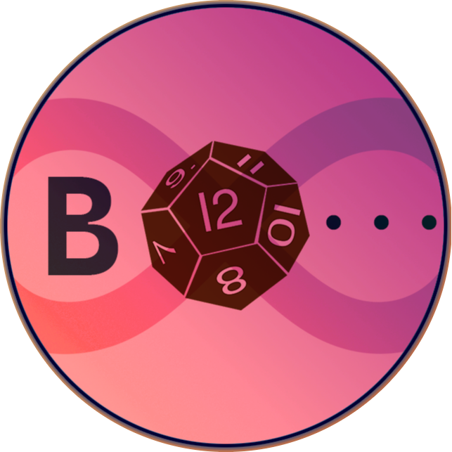

# Hello, I'm Robert, a freelance and independent developer.

___

🔗 _Jump to:_
- [🕹️ Apocalypse Couriers Game](#%EF%B8%8F-apocalypse-couriers-8-bit-game)
- [🍵 Course Sync](#-course-sync)
- [🪡 My other projects](#-my-other-projects-consist-of)
- [🎀 A Little More About Me](#-a-little-more-about-me)

___

## [Battles, Hunts, & More+](https://github.com/robertvargas-irq/battles-and-hunts-bot) | My Current Primary Project

### Storytelling made easy.

Battles, Hunts & More is a Discord bot that supercharges the process of storytelling and role-play within a Discord server.

🖼️ [__View the full README with visuals included.__](https://github.com/robertvargas-irq/battles-and-hunts-bot/tree/dev_build#readme)

### 🏓 Player Features
Comeplete with character creation, **BHM+** allows players to fully document their character's (or characters') backstory, history, and any stats that define their combat readiness, hunting abilities, and general stature and survivability. This leans into their proficiency in hunting, hunger, and fully-fledged and customizable __Turn-Based Combat System__ mechanics available to all players in __BHM+__!

> 💬 Players also have the ability to speak as their character in-chat, switching between multiple on a whim!

### 🎨 Server Design
Server administrators have full control over the universe that they design, from name, history, and visuals, down to the alliance groups that exist that players can become a part of (and those are customizable too)!

Alongside universe customizability, administrators can create NPCs to further interact with players in their world! NPCs also utilize the speaking mechanics, and will automatically appear for Administrators when speaking in character.

### 📦 Inventory & Storage Containers

Players may also hunt, carry, and deposit food into storage containers, or eat it themselves straight from their inventory! (Items will be arriving in v6.0, and the storage system is fully prepared for its implementation).

Server administrators may set up their storage containers to suit the story's needs, including setting the alliances who own the container, alliances that may take or deposit, and if the container may be "secretly" stolen from.

### ⚔️ Battle System

The battle system for __BHM+__ is fully turn-based and customizable to the server administrators' hearts' intent! Up to five teams may be present, and players may add any character they wish to battle!

The host of the battle is also able to add any of the NPCs created in the server, along with scaling them up with preset "levels", which scale up all their stats by 1 per level to have a more dynamic battle, and removing the need to create unique NPCs for each and every level possible.

#### You can even have up to 5 teams!

___

## 🕹️ Apocalypse Couriers [8-Bit Game]

Apocalypse Couriers is a top-down package-delivery game with a linear storyline, much like Hideo Kojima’s Death Stranding in which you deliver essential packages across a barren, twisted landscape for the entirety of the game; the twist, however, is that you battle medieval enemies that block your path from one merchant to another in randomly generated “dungeon” maps in the middle of the apocalypse, enemies twisted and distorted as hellish versions of themselves become apparent within the game. It’s like hell just merged with earth and humans are the final creatures left alive without any significant altercations.

The procedural generation is be simple and works in similar fashion to The Binding of Isaac’s map generation: one entry point, with randomized rooms surrounding the player, enemy-filled rooms all throughout, and a final room with the merchant's stand within.

Quests are linear, 3 in total equating to 3 total, uniquely-designed floors as you run from one merchant to another, merchants filling you in on the world as you progress, but the dynamic portion and replay-ability that transforms this from a linear RPG like Final Fantasy into a dungeon-crawler like Crypt of the NecroDancer, clearing floor-by-floor of enemies to progress to the next level, is the random floor generation and enemy population each time you travel from one merchant to another.

Most dungeon-crawlers have hack-and-slash mechanics, while Apocalypse Couriers takes the player on a turn-based combat journey through the medieval wasteland, facing off against typical medieval enemies but mangled through the horrors of the waking apocalypse. The player faces-off against these creatures turn-by-turn, going first and choosing their attack. The player has 4 methods of attack, consisting of two light attacks and two heavy attacks, each with their own stats and selectable by their corresponding arrow key.

The player grows stronger based on any power-ups in the forms of “ancient artifacts” that they pick up; health, accuracy, and damage bonuses, reflecting in the respective indicators by the attack itself. These artifacts are either permanent, lasting until the end of the run, or temporary, persisting only within the current floor.

See what awaits in hell-on-earth in this new turn-based, horrifying package-delivery game of doom!

#### 🔗 Helpful links
> __Check out the full [README](https://github.com/robertvargas-irq/gamedev-pico8-game-source#readme) and [Source Code](https://github.com/robertvargas-irq/gamedev-pico8-game-source)__.
> 
> 🎮 [__Play the finished project here!__](https://robertvargas-irq.github.io/gamedev-pico8-project/game/ac_v_1_0)

___

## 🍵 [Course Sync](../../../university-course-sync-discord-bot)

### Set it, and forget it.
With Course Sync, you won't need to struggle with non-functioning reaction roles or updating them every time you join new server.
Input your courses, and we'll do the rest 🍵

This bot is fully-equipped with auto course-sync capabilities, allowing you to declare your classes, and it will seamlessly sync them across every server that utilizes this bot.
With easy-to-use menus, and a simple user-friendly interface, Course Sync allows for easy setup, both on the student's side and the community manager.

This service allows for multiple servers across NMSU* Discord servers to be fully interconnected, and network with each other by allowing easy, automatic assignment of class roles, creation of class chats, and syncronization across multiple servers!
This will allow for new or existing servers to provide channels for certain departments, or even all depending on who joins. The bot does all the heavy lifting, all you have to do is declare which classes you are taking this semester, and the bot will take care of the rest!

*This bot is not affiliated with New Mexico State University in any way, shape or form, and is not endorsed by the university.

___

### 🪡 My other projects consist of
* [**Independent Valorant eSports League Discord Bot**](../../../valorant-league-bot), complete with team management, moderation, and user profiles to enhance competitor experiences across the board.

___

### 🧵 Upcoming projects
* Nothing for now ✨

___

 

## 🎀 A Little More About Me
- 🪴 I am interested in creating wholistic software solutions, and to create a story-heavy video game.
- 🔮 Away from code, I love to watch movies and fall down a rabbit hole of murder mysteries.
- 🍁 Disney is my obsession, and I wouldn't have it any other way.

___

📫 **You can reach me directly at robertvargas.eptx@gmail.com for any queries or concerns.**

___

<!---
robertvargas-irq/robertvargas-irq is a ✨ special ✨ repository because its `README.md` (this file) appears on your GitHub profile.
You can click the Preview link to take a look at your changes.
--->
